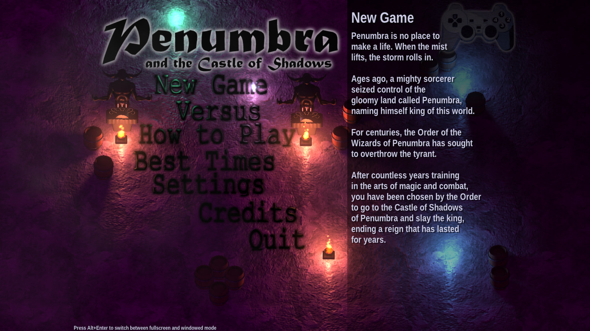
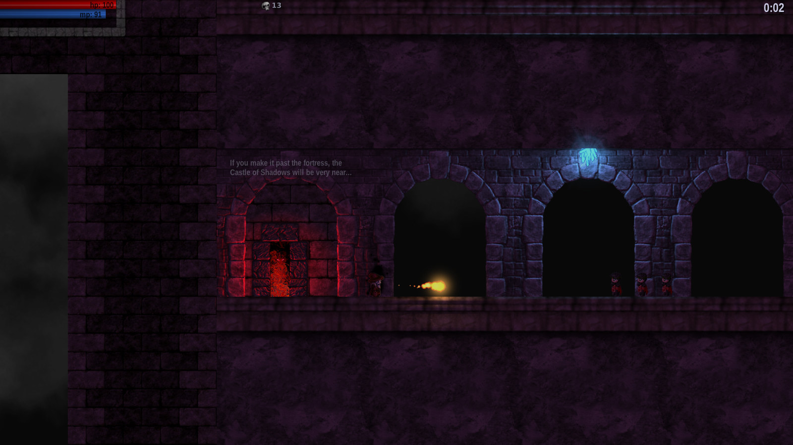
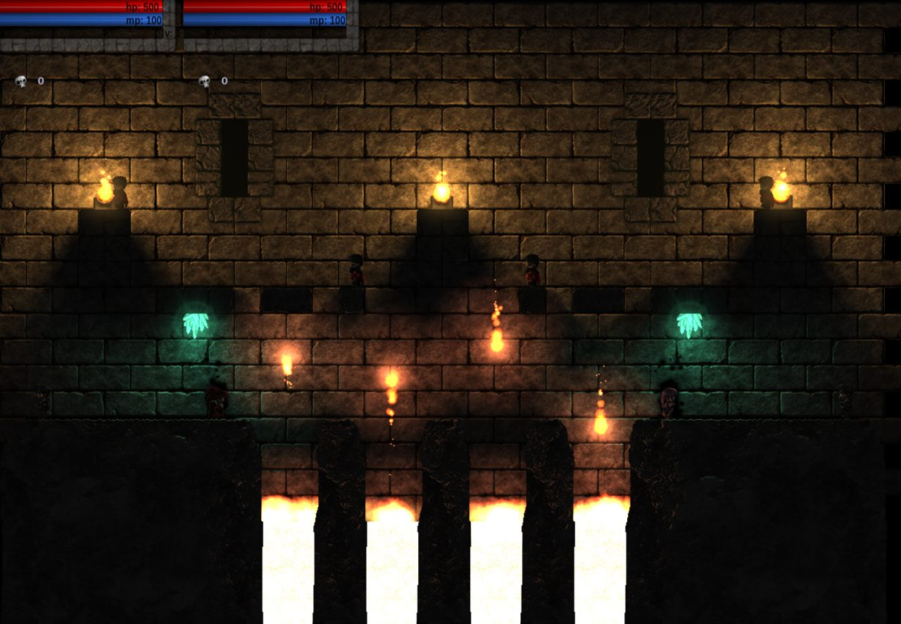
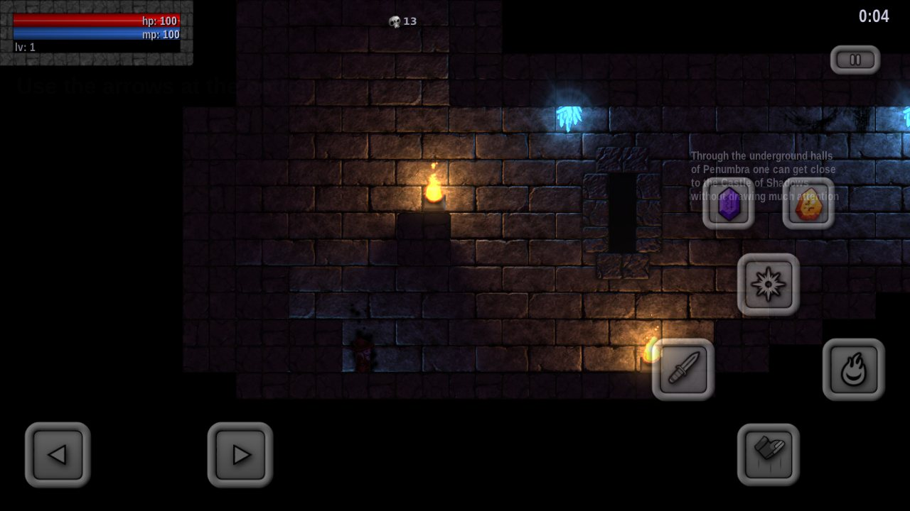
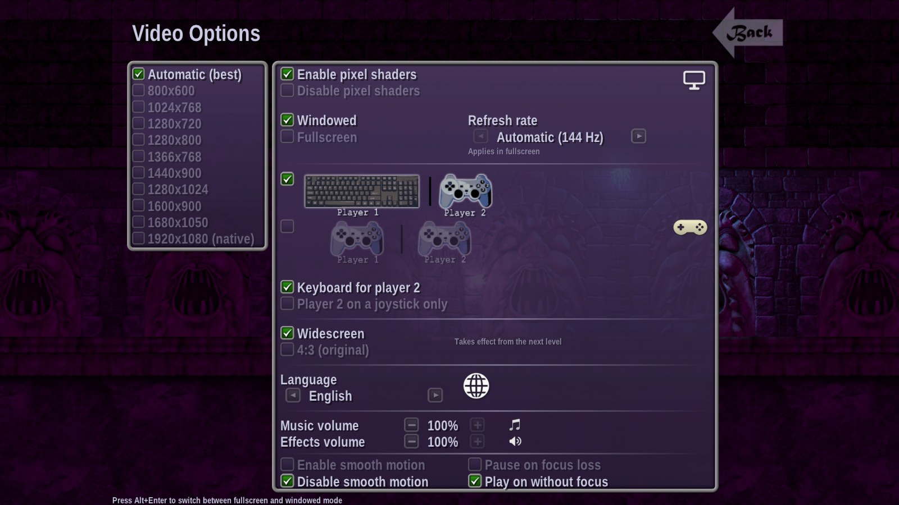
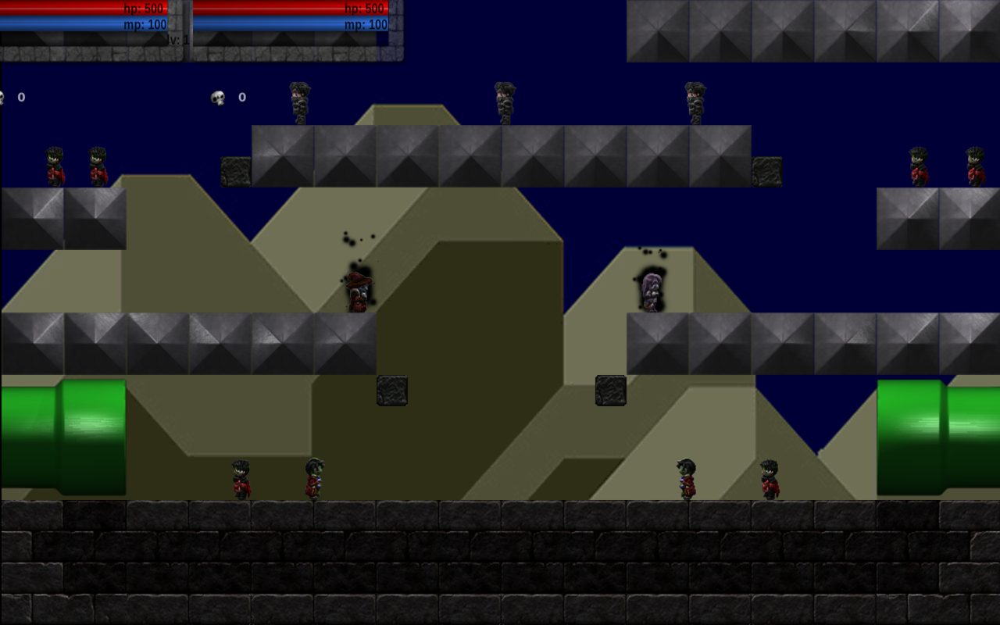
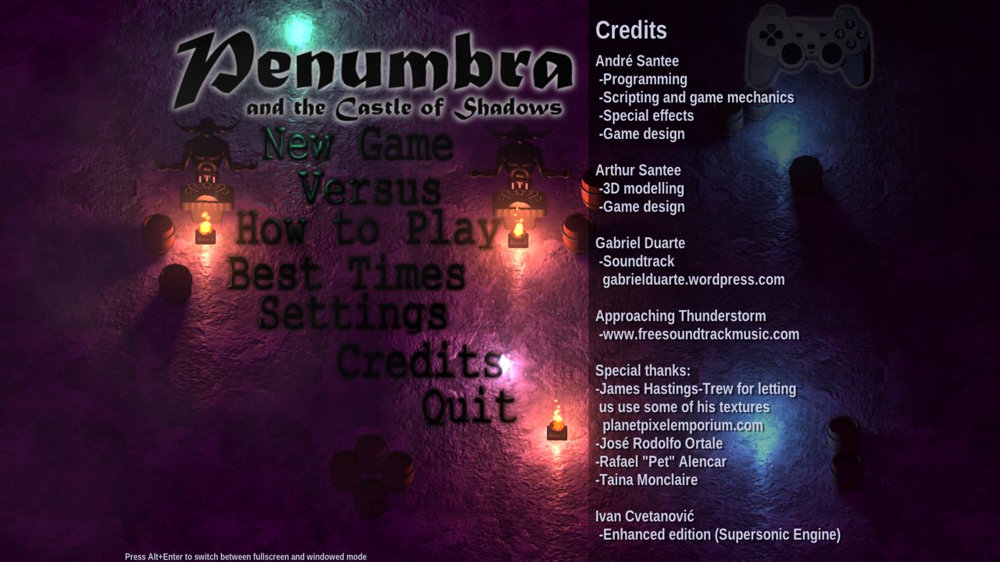
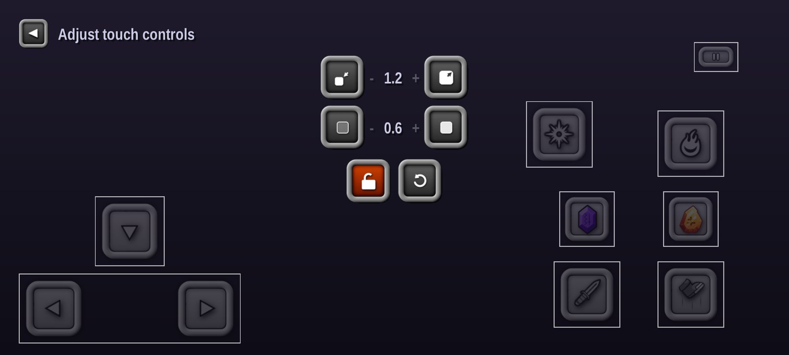
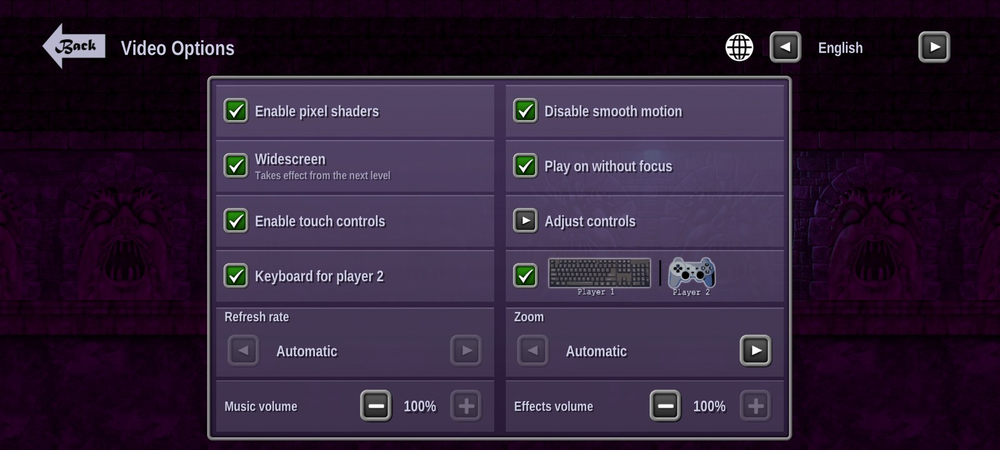

<div align="center">

# Penumbra and the Castle of Shadows — Enhanced

**The 2010 action platformer by André Santee, enhanced for modern systems.**

<a href="https://github.com/IvanCvetanovic/Penumbra-and-the-Castle-of-Shadows-Enhanced/releases/latest/download/Penumbra-Windows.zip"></a>&nbsp;&nbsp;<a href="https://github.com/IvanCvetanovic/Penumbra-and-the-Castle-of-Shadows-Enhanced/releases/latest/download/Penumbra-Android.apk"></a>

<a href="https://github.com/IvanCvetanovic/Penumbra-and-the-Castle-of-Shadows-Enhanced/releases/latest/download/Penumbra-macOS.zip"></a>&nbsp;&nbsp;<a href="https://github.com/IvanCvetanovic/Penumbra-and-the-Castle-of-Shadows-Enhanced/releases/latest/download/Penumbra-Linux.tar.gz"></a>

<a href="https://github.com/IvanCvetanovic/Penumbra-and-the-Castle-of-Shadows-Enhanced/releases/latest/download/Penumbra-iOS.ipa"></a>

**New to this?** After the download, follow the [step-by-step guide](docs/install.md) ([Português](docs/install.pt.md)): Windows and Android each ask for a few extra clicks the first time. The Mac, Linux, and iPhone and iPad downloads are newer and less tested than Windows and Android (see [Platform status](#platform-status)); the iPhone and iPad one is experimental and needs a computer to install ([read this first](docs/install.md#iphone-and-ipad-experimental)).

### [How to install: step by step](docs/install.md)

Most players should use that guide: it has a download and simple, illustrated steps for every device, in English
and [Portuguese](docs/install.pt.md).<br>
Free, with no ads and no accounts. It runs on Windows 10 or 11 (64-bit), on Android 8 or newer, on a Mac with macOS 13.3
or newer, and on 64-bit Linux from about 2022 on. It needs a graphics driver with Vulkan 1.2: most PCs from the last
eight years or so have one, and so do many (not all) phones; see [the install guide](docs/install.md#android-phone-or-tablet) for the phones that do not.<br>
The Windows download is not code-signed yet (it has no digital signature from a publisher), so Windows asks you to
confirm before it runs, and **Windows 11 PCs with Smart App Control turned on may refuse to run it**
([how to check](docs/install.md#windows-pc)). The Mac app is not notarised by Apple (Apple's own check of apps from
outside the App Store), so the Mac asks you to allow it once: [Code signing policy](docs/code-signing.md).

Something not working? [Report a problem](https://github.com/IvanCvetanovic/Penumbra-and-the-Castle-of-Shadows-Enhanced/issues/new/choose): the form asks for what a fix needs (your device,
its system version and the game version).

[](https://github.com/IvanCvetanovic/Penumbra-and-the-Castle-of-Shadows-Enhanced/actions/workflows/ci.yml)
[](https://github.com/IvanCvetanovic/Penumbra-and-the-Castle-of-Shadows-Enhanced/actions/workflows/apple.yml)


[](https://github.com/IvanCvetanovic/Penumbra-and-the-Castle-of-Shadows-Enhanced/blob/main/LICENSE.md)
[](#how-it-was-made)













</div>

## About

*Penumbra and the Castle of Shadows* (2010) was made by André Santee (Asantee) on his Ethanon
Engine. You play a wizard with a sword, fireballs and a light spell, fighting through three levels
to the castle's king, alone, in co-op, or in Versus.

This is an **enhanced edition**, not a remake: the original's own scripts are ported to C++ line by
line and read the original's own files, so the game plays as it did, apart from the changes listed in
[`docs/enhancements.md`](docs/enhancements.md). It runs on Ivan Cvetanović's
[Supersonic Engine](https://github.com/IvanCvetanovic/Supersonic-Engine), whose logo it shows for
two seconds when it starts, and is published with André Santee's explicit permission.

## What's enhanced

| | |
|---|---|
| **Display** | Widescreen at any resolution; the best resolution and refresh rate chosen automatically, or by hand; smooth motion on fast monitors |
| **Controls** | Modern gamepads, a keyboard second player, on-screen touch controls you can resize, fade and move, a pause |
| **Difficulty** | Normal, the original game, or Hard, where every enemy has twice the health, chosen when you start a new game; the best times are kept for each |
| **Languages** | English, German, Spanish, French, Italian, Portuguese, Russian, Turkish, Ukrainian, Japanese and Arabic, following your system's language by itself, and switchable in game from the Settings screen. The translations were made with AI help and have not been checked by native speakers; corrections are welcome ([report a problem](https://github.com/IvanCvetanovic/Penumbra-and-the-Castle-of-Shadows-Enhanced/issues/new/choose)) |
| **Platforms** | Downloads for Windows, Android, Mac and Linux, and an experimental one for iPhone and iPad |
| **Fixes** | Bugs of the original fixed, and its rendering matched more closely |

Every change is listed with what the original did in [`docs/enhancements.md`](docs/enhancements.md).

## Platform status

| Platform | Status | What was checked | Download |
|---|---|---|---|
| Windows |  | Played through by a person; over 48,000 automated checks, all passing on GitHub's Windows runner; not code-signed, so Windows 11 PCs with Smart App Control on may refuse to run it | [Penumbra-Windows.zip](https://github.com/IvanCvetanovic/Penumbra-and-the-Castle-of-Shadows-Enhanced/releases/latest/download/Penumbra-Windows.zip) |
| Linux |  | All 17 test suites (over 48,000 checks) pass in the release build; the download itself, unpacked read-only, plays level 1 on a software Vulkan driver; not played by a person | [Penumbra-Linux.tar.gz](https://github.com/IvanCvetanovic/Penumbra-and-the-Castle-of-Shadows-Enhanced/releases/latest/download/Penumbra-Linux.tar.gz) |
| Android |  | Played through on a real phone by a person, the touch editor included (an earlier build); the newest button layout was only checked on an emulator, and nothing added since that build has been played through on a real phone: 1.0.6's support for phones with Vulkan 1.1 (an Oppo A74 5G runs it), 1.0.7's report of an unexpected end and its smaller scene picture on weak GPUs (frame rates measured on a Xiaomi Pad 5 and a Pixel 9 Pro XL, not played through), and 1.0.8's background loading of the first level's music, its touch-focus fix, its smaller memory footprint and its New Game difficulty prompt (tried on an emulator only); scripted tests on an emulator | [Penumbra-Android.apk](https://github.com/IvanCvetanovic/Penumbra-and-the-Castle-of-Shadows-Enhanced/releases/latest/download/Penumbra-Android.apk) |
| macOS |  | Tests pass on GitHub Actions; the download runs level 1 on GitHub's Apple silicon Macs, and its Intel half there under Rosetta; not played; never run on a real Intel Mac; not notarised | [Penumbra-macOS.zip](https://github.com/IvanCvetanovic/Penumbra-and-the-Castle-of-Shadows-Enhanced/releases/latest/download/Penumbra-macOS.zip) |
| iOS |  | Compiles; never run on any iPhone or iPad | Experimental: [Penumbra-iOS.ipa](https://github.com/IvanCvetanovic/Penumbra-and-the-Castle-of-Shadows-Enhanced/releases/latest/download/Penumbra-iOS.ipa), for [sideloading](docs/playing.md#iphone-and-ipad-experimental) |

> [!IMPORTANT]
> The Windows version, and an earlier Android build on one real phone, have been played by a person; the newest
> Android button layout was only checked on an emulator, and nothing added since has been played through on a real phone (1.0.6 lets phones with Vulkan 1.1 start the game; 1.0.7 was measured, not played, on a tablet and a phone; 1.0.8 was only tried on an emulator). Linux and macOS
> are verified by automated tests only; the iPhone/iPad version has never run on an iPhone or iPad.

## Build from source

```bash
git clone --recurse-submodules https://github.com/IvanCvetanovic/Penumbra-and-the-Castle-of-Shadows-Enhanced.git
```

| Platform | Build and run | Needs |
|---|---|---|
| Windows | `tools\build.bat` (Command Prompt or PowerShell), or from Git Bash `cmd //c "tools\build.bat"`; then `build\game\Penumbra.exe` | Visual Studio Build Tools (C++), CMake, Ninja |
| Linux | `bash tools/build_linux.sh`, then `~/pn-build-linux/game/Penumbra` | [packages](docs/building.md#linux-x64), X11 or XWayland |
| Android | `bash tools/build_android.sh --abi all` (APK in `out/android/`) | Android SDK and NDK, JDK 17, Python 3 with Pillow |
| macOS, iOS | The [Apple workflow](https://github.com/IvanCvetanovic/Penumbra-and-the-Castle-of-Shadows-Enhanced/blob/main/.github/workflows/apple.yml) on GitHub Actions; the downloads, the [release workflow](https://github.com/IvanCvetanovic/Penumbra-and-the-Castle-of-Shadows-Enhanced/blob/main/.github/workflows/release.yml) | |

A GPU with **Vulkan 1.2** is required. The original game's files are already in `extracted/`; nothing else needs to be
downloaded, and `bash tools/build_linux.sh --test` or `build\tests\test_pn_all.exe` runs the tests. Details:
[`docs/building.md`](docs/building.md) · [`docs/playing.md`](docs/playing.md).

## Controls

| Action | Keyboard | Gamepad |
|---|---|---|
| Walk | ← → | Stick or D-pad |
| Jump | ↑ or Ctrl | A |
| Sword · Fireball · Light | S · D · Space | X · B · Y |
| Pause | Esc | Back |

> [!TIP]
> Combos: **← ← S** (sword beam) and **↓ ← D** (blast), each key a separate tap, one after another. On phones the game draws its own buttons,
> including one-tap combos, which rest for a second after each use (combos typed on a keyboard or a pad do not).
> Everything else is in [`docs/controls.md`](docs/controls.md).

## How it was made

> [!NOTE]
> The enhanced edition was directed and reviewed by **Ivan Cvetanović** and developed with
> **[Claude Code](https://claude.com/claude-code)**, Anthropic's AI coding tool: the porting, the
> engine work, the tests and the documentation. [`CLAUDE.md`](https://github.com/IvanCvetanovic/Penumbra-and-the-Castle-of-Shadows-Enhanced/blob/main/CLAUDE.md), [`DEVLOG.md`](https://github.com/IvanCvetanovic/Penumbra-and-the-Castle-of-Shadows-Enhanced/blob/main/DEVLOG.md)
> and [`docs/planning/`](https://github.com/IvanCvetanovic/Penumbra-and-the-Castle-of-Shadows-Enhanced/blob/main/docs/planning/2026-09-27-penumbra-port.md) are the working record.

Tests: 17 suites (over 48,000 checks) check the port against the original's files, and five of them play the game
headless ([`docs/testing.md`](docs/testing.md)).

## Credits

- **Original game (2010):** André Santee (programming, game design, Ethanon Engine), Arthur
  Santee (3D modelling, game design), Gabriel Duarte (soundtrack), Approaching Thunderstorm
  (music); thanks to James Hastings-Trew, José Rodolfo Ortale, Rafael "Pet" Alencar, Taina Monclaire.
- **Enhanced edition:** Ivan Cvetanović, developed with Claude Code.
- **Touch buttons, the options screen's frames, buttons and icons, and the touch-controls editor's buttons:** from *Magic Rampage*, by Asantee Games (the globe and the monitor icons are drawn for this edition).
- **Third-party:** TinyXML, dr_mp3, Liberation, DejaVu and Noto fonts, and the engine's libraries
  ([list](https://github.com/IvanCvetanovic/Supersonic-Engine/blob/main/THIRD_PARTY_LICENSES.md)).

## Licence

- **Ivan Cvetanović's code and the Supersonic Engine:** [MIT No Attribution](https://github.com/IvanCvetanovic/Penumbra-and-the-Castle-of-Shadows-Enhanced/blob/main/LICENSE), completely
  free to use.
- **The ported scripts** (`game/script/`) **and the Ethanon runtime** (`game/eth/`): LGPL-3.0-or-later.
- **The original game's files and the Magic Rampage art (the touch buttons, the options screen's frames, buttons and icons, and the touch-controls editor's buttons):** their authors' property.

The `extracted/` folder holds the original 2010 game's files, which the enhanced edition reads. It is not the download; to play, use the buttons at the top.

> [!WARNING]
> Provided **as is, without any warranty**. Ivan Cvetanović is not responsible for anything that
> happens through its use, including lost data, damage to hardware, or display problems (the game
> can change a monitor's resolution and refresh rate). Use it at your own risk. Full terms:
> [`LICENSE.md`](https://github.com/IvanCvetanovic/Penumbra-and-the-Castle-of-Shadows-Enhanced/blob/main/LICENSE.md).
