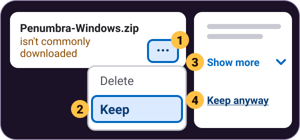
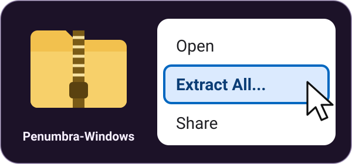
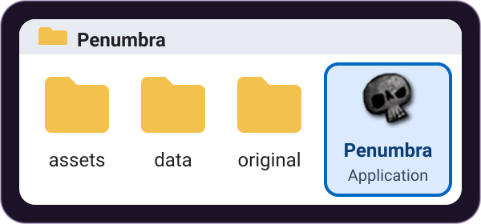
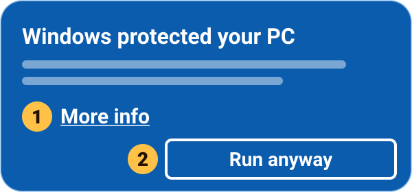
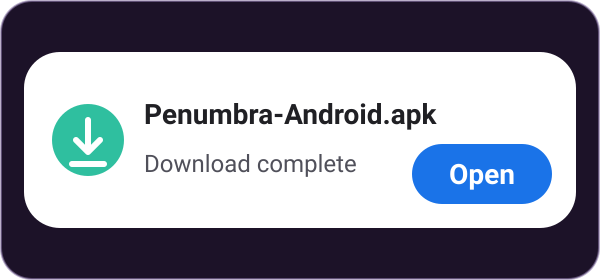
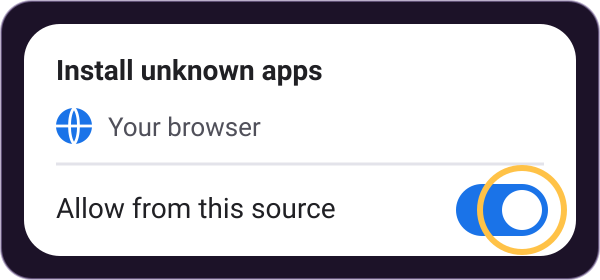
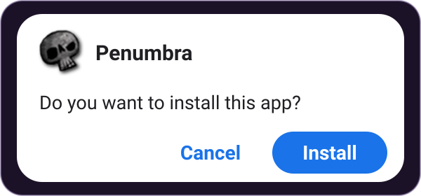
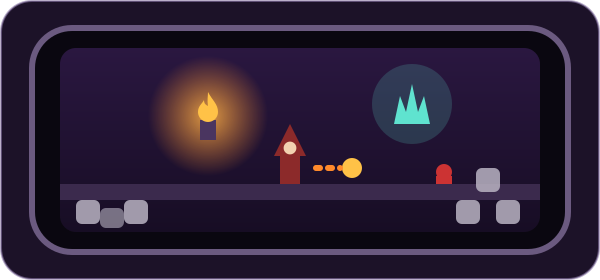

# How to install

[Português](install.pt.md)

Free. No ads, no in-app purchases, no accounts. Works offline and collects no data: the game never connects to the internet.

Pick your device: [Windows PC](#windows-pc), [Android phone or tablet](#android-phone-or-tablet), or [Other downloads](#other-downloads) (Mac, Linux, iPhone and iPad). Every download is a file of [the latest release](https://github.com/IvanCvetanovic/Penumbra-and-the-Castle-of-Shadows-Enhanced/releases/latest):

| | File | Download |
|---|---|---|
| Windows | `Penumbra-Windows.zip` | [Download](https://github.com/IvanCvetanovic/Penumbra-and-the-Castle-of-Shadows-Enhanced/releases/latest/download/Penumbra-Windows.zip) |
| Android | `Penumbra-Android.apk` | [Download](https://github.com/IvanCvetanovic/Penumbra-and-the-Castle-of-Shadows-Enhanced/releases/latest/download/Penumbra-Android.apk) |
| Mac | `Penumbra-macOS.zip` | [Download](https://github.com/IvanCvetanovic/Penumbra-and-the-Castle-of-Shadows-Enhanced/releases/latest/download/Penumbra-macOS.zip) |
| Linux | `Penumbra-Linux.tar.gz` | [Download](https://github.com/IvanCvetanovic/Penumbra-and-the-Castle-of-Shadows-Enhanced/releases/latest/download/Penumbra-Linux.tar.gz) |
| iPhone / iPad (experimental) | `Penumbra-iOS.ipa` | [Download](https://github.com/IvanCvetanovic/Penumbra-and-the-Castle-of-Shadows-Enhanced/releases/latest/download/Penumbra-iOS.ipa) |

All files and their checksums ([`SHA256SUMS.txt`](https://github.com/IvanCvetanovic/Penumbra-and-the-Castle-of-Shadows-Enhanced/releases/latest/download/SHA256SUMS.txt)): [the Releases page](https://github.com/IvanCvetanovic/Penumbra-and-the-Castle-of-Shadows-Enhanced/releases).

The Windows download is not code-signed yet, and the Mac app is not notarised by Apple: [Code signing policy](code-signing.md).

## Windows PC

**You need:** Windows 10 or 11 (64-bit) and a graphics driver that supports Vulkan 1.2 (most PCs from the last eight years or so have one).

> **Check this first on Windows 11:** this download is not code-signed yet, so a PC with **Smart App Control** turned on may refuse to run it, and there is no *Run anyway* button for that. To see whether it is on, open **Settings**, **Privacy & security**, **Windows Security**, **App & browser control**, then **Smart App Control settings** (or open **Windows Security** from the Start menu). If it says **On**, this version may not run on that PC yet. Please don't turn Smart App Control off just for this game. Windows 10 does not have it.

**[Download for Windows](https://github.com/IvanCvetanovic/Penumbra-and-the-Castle-of-Shadows-Enhanced/releases/latest/download/Penumbra-Windows.zip)**

1. **Keep the download.** If the browser says *Penumbra-Windows.zip isn't commonly downloaded*: in Edge, click the **···** next to it, then **Keep**, then **Show more**, then **Keep anyway**. In Chrome, choose **Keep**.

   

   - Browsers say this about new files that few people have downloaded yet.
2. **Extract the zip.** In your *Downloads* folder, right-click *Penumbra-Windows*, choose **Extract All**, then **Extract**. (Or open it and click **Extract all** at the top.)

   

   - Don't play from inside the zip: the game needs all of its files.
3. **Open the new folder**, then the **Penumbra** folder inside it. There you'll find **Penumbra**, with a grey skull icon (the one at the top of this page). Its type is *Application* (with file extensions shown, it's *Penumbra.exe*).

   
4. **Double-click Penumbra** (the skull) to start the game.

   
5. **If a blue window says “Windows protected your PC”**, click **More info**, then **Run anyway**. Windows shows this because the game is new and not signed yet.

   

   - On a Windows 11 PC with Smart App Control turned on, there may be no *Run anyway* button: see *Check this first on Windows 11* above, or *It didn't start?* below.

Have fun!

It didn't start?

- **“VCRUNTIME140.dll was not found” or “MSVCP140.dll was not found”:** the game was started from inside the zip. Extract the zip first (step 2).
- **“Penumbra could not find its game files”:** it was started from inside the zip. Extract the zip first (step 2).
- **“Penumbra could not start its graphics”:** update the graphics driver through Windows Update or from the NVIDIA, AMD or Intel website (ask an adult to help). A very old PC may not be able to run the game.
- **“MFPlat.DLL was not found”:** this PC has an “N” edition of Windows, which comes without Windows' media features. Install Microsoft's free *Media Feature Pack* (on Windows 10 and 11: Settings, Apps, Optional features, Add a feature), then start the game again. Ask an adult to help.
- **“Penumbra cannot run from this folder”:** move the *Penumbra* folder somewhere simple, like *C:\Games\Penumbra*, and try again.
- **A black or white window that doesn't answer, and Windows offers to *Wait* or *Close the program*:** click **Wait** and give it a minute: the first start prepares the graphics, and a slower PC can take a while. If it never comes alive, close it and start the game again: after a start that did not get as far as its first picture, the game opens in a window instead of covering the screen. If it still doesn't start, please [report it](https://github.com/IvanCvetanovic/Penumbra-and-the-Castle-of-Shadows-Enhanced/issues/new/choose) and attach the file *penumbra-unfinished.log*, the log of the start that didn't finish (the game keeps it when it starts again): type `%APPDATA%\Penumbra` into the address bar of a File Explorer window to find it. If there is no such file, attach *penumbra.log*, and copy it *before* starting the game again, because every start replaces it.
- **Windows says “An Application Control policy has blocked this file”, or a message that mentions Smart App Control:** on some Windows 11 PCs, Smart App Control blocks apps that are not signed, and there is no *Run anyway* button. This version may not run on those PCs yet. Please don't turn Smart App Control off just for this game.

## Android phone or tablet

**You need:** Android 8 or newer, and graphics that support Vulkan 1.1 (most phones that came with Android 10 or newer have it). Versions up to 1.0.5 needed Vulkan 1.2 and closed as soon as they opened on the many phones that only have 1.1: if that happened to you, download this version.

> **Tested:** an earlier version of the Android game was played through on a real phone by the person who made it, including the screen that adjusts the buttons. The newest button layout was only tried on an Android emulator, where the game was also tested automatically. Other phones may behave differently.

**[Download for Android](https://github.com/IvanCvetanovic/Penumbra-and-the-Castle-of-Shadows-Enhanced/releases/latest/download/Penumbra-Android.apk)**

1. **Download it on the phone** and open *Penumbra-Android.apk* from the notification or your *Downloads*. If Chrome warns about the file, tap **Download anyway**.

   

   - **Nothing happens when you tap Download?** Open this page in Chrome: tap the menu (**⋮** or **···**), then **Open in browser**.
2. **Allow the install.** Android asks to let your browser install unknown apps: tap **Settings**, turn on **Allow from this source** and go back.

   

   - **For a grown-up, on newer Samsung phones:** if the phone blocks the install, open **Settings**, then **Security and privacy**, then **Auto Blocker**. Turn it off, install the game, then turn Auto Blocker back on.
3. **Tap Install.** If Google Play Protect warns you, that's because the game isn't from the Play Store: choose to install anyway (the option can be under **More details**).

   
4. **Tap Open and play!** Hold the phone sideways. The game draws its own buttons on the screen, and a Bluetooth gamepad works too.

   

Have fun!

It didn't work?

- **A message appears and the game closes:** read it. It says what the phone's graphics report: the game needs Vulkan 1.1 or newer, and a very old phone (Vulkan 1.0) cannot run it. Whatever it says, please tell us the phone's model and send a screenshot of the message (see the link at the end of this guide). If the game closes with no message, report that too. Open it again: on Android 11 and later, a window titled "Penumbra closed unexpectedly last time" may appear, with what the phone recorded about that run. Tap **Share** and send it with the phone's model (or take a screenshot of it, scrolling down to the end), then tap **OK** to play. To see what a phone has yourself, install the free app *Hardware CapsViewer for Vulkan* (also called *Vulkan Hardware Capability Viewer*, by Sascha Willems), open the *Properties* tab and read the *apiVersion* row (not the one in its About box).
- **A Samsung phone blocked the install:** see the note for grown-ups in step 2 (Auto Blocker).
- **Downloaded it on a computer?** Open this page on the phone and download it there.
- **iPhone or iPad?** There's only an [experimental version](#iphone-and-ipad-experimental) for them, further down this page.

## Other downloads

Mac, Linux, iPhone and iPad: the same game for more devices. The Mac and Linux versions are new, and the iPhone and iPad version is only an experiment.

### Mac

**You need:** macOS 13.3 Ventura or newer. One app for Macs with Apple silicon (M1 or newer) and for Intel Macs.

> **New:** the Mac version has only been tested automatically, on GitHub's Macs. Nobody has played it on a real Mac yet, and it has never been tried on an Intel Mac.

**[Download for Mac](https://github.com/IvanCvetanovic/Penumbra-and-the-Castle-of-Shadows-Enhanced/releases/latest/download/Penumbra-macOS.zip)**

1. **Unzip it.** Safari does this by itself. If not, double-click *Penumbra-macOS.zip* in *Downloads*.
2. **Open the Penumbra folder** and drag **Penumbra** into **Applications**.
3. **Double-click Penumbra.** The first time, the Mac won't open it, because the game isn't from the App Store and isn't notarised by Apple.
4. **Open it anyway, once.** On macOS 15 Sequoia and newer: at *“Penumbra” Not Opened*, click **Done** (not *Move to Trash*). Then open the Apple menu, **System Settings**, **Privacy & Security**, scroll down to *Security* and click **Open Anyway**. Enter the Mac's password and click **Open Anyway** again.
   - On macOS 13 or 14: close the message (don't choose **Move to Trash**), then Control-click (or right-click) Penumbra, choose **Open**, then click **Open**.
   - After that, Penumbra opens with a double-click like any other app.

It didn't start?

- **“Penumbra is damaged and can't be opened”:** download it again and unzip it with Finder (double-click the zip).
- **The game jumps in the Dock and closes:** the Mac's graphics could not start it. What happened is written to *~/Library/Application Support/Penumbra/penumbra.log*.
- **Can't find *Open Anyway*?** Try to open Penumbra first, then look in System Settings, Privacy & Security, under *Security* (scroll down).
- Please don't turn Gatekeeper off just for this game.
- The *HOW TO PLAY* file in the Penumbra folder you downloaded has more help. Progress and settings are kept in *~/Library/Application Support/Penumbra*.

### Linux PC

**You need:** a 64-bit PC with an Intel or AMD processor (x86_64) and a Linux from about 2022 on (Ubuntu 22.04, Debian 12, Linux Mint 21 or newer, Fedora, Arch or SteamOS), a graphics driver with Vulkan 1.2, and an X11 desktop or Wayland with XWayland.

> **New:** the Linux version passes all of the game's automated tests, but nobody has played it on a real Linux PC yet.

**[Download for Linux](https://github.com/IvanCvetanovic/Penumbra-and-the-Castle-of-Shadows-Enhanced/releases/latest/download/Penumbra-Linux.tar.gz)**

1. **Extract it.** Right-click *Penumbra-Linux.tar.gz* and choose **Extract Here**. (In a terminal: `tar xzf Penumbra-Linux.tar.gz`)
2. **Open the Penumbra folder** and double-click **Penumbra**. If the file manager asks, choose **Run**. (In a terminal: `cd Penumbra`, then `./Penumbra`)

It didn't start?

- **Nothing happens:** start it from a terminal (step 2) to see why. The game also writes a log to *~/.local/share/Penumbra*.
- **An error about Vulkan:** install a Vulkan driver: *mesa-vulkan-drivers* on Ubuntu, Debian and Fedora (AMD and Intel graphics), *vulkan-radeon* or *vulkan-intel* on Arch. NVIDIA's own driver already has it.
- **“error while loading shared libraries: libvulkan.so.1”:** install the Vulkan loader (*libvulkan1* on Ubuntu and Debian, *vulkan-loader* on Fedora, *vulkan-icd-loader* on Arch) and a Vulkan driver (see above).
- **“could not report the required Vulkan instance extensions”:** install a Vulkan driver for your graphics (see above).
- **“Failed to initialize GLFW”:** the game could not open a window. It needs an X11 or XWayland desktop session.
- **No window opens:** the game needs an X11 desktop, or Wayland with XWayland.
- The *HOW TO PLAY* file beside the Penumbra folder has more help. Progress, settings and the log are kept in *~/.local/share/Penumbra*.

### iPhone and iPad (experimental)

**You need:** iOS or iPadOS 16.3 or newer, a Windows PC or a Mac, and an Apple ID (a spare one is fine).

> **Experimental:** this version has never run on any iPhone or iPad, so it may not start. It isn't on the App Store, and it can't be installed by tapping it.

**[Download for iPhone and iPad](https://github.com/IvanCvetanovic/Penumbra-and-the-Castle-of-Shadows-Enhanced/releases/latest/download/Penumbra-iOS.ipa)**

1. **On the computer**, download *Penumbra-iOS.ipa* and install it on the iPhone or iPad with a free sideloading tool: **Sideloadly**, **AltStore** or **SideStore**. It signs the game with your Apple ID.
2. **Turn on Developer Mode** on the iPhone or iPad: **Settings**, **Privacy & Security**, **Developer Mode**. Then restart it.
3. **Trust your Apple ID** in **Settings**, **General**, **VPN & Device Management**.
4. **Open Penumbra** and hold the device sideways. The game draws its own buttons on the screen, and a controller should work too.

Good to know

- **With a free Apple ID**, the app stops opening after 7 days. Then refresh it in AltStore or SideStore, or install it again with Sideloadly. Your progress stays, unless you delete the app.
- A free Apple ID can have 3 sideloaded apps at a time.
- **It doesn't start, or it closes at once:** this version has never been tried on a real iPhone or iPad, so it may not work yet.

## What is it?

**Penumbra and the Castle of Shadows** is a 2D action platformer made in 2010 by **André Santee**. You are a wizard with a sword, fireballs and a light spell, fighting through three levels to the king of the castle: alone, with a friend, or against each other in Versus.

This **enhanced edition** by **Ivan Cvetanović** plays just like the original, with:

- Widescreen, at any resolution
- Gamepads, and a second player on the same keyboard
- Touch controls on phones and tablets
- Eleven languages: English, Portuguese, Spanish, French, German, Italian, Russian, Turkish, Ukrainian, Japanese and Arabic. The translations were made with AI help and have not been checked by native speakers; corrections are welcome ([report a problem](https://github.com/IvanCvetanovic/Penumbra-and-the-Castle-of-Shadows-Enhanced/issues/new/choose))

## Controls

| | Keyboard | Gamepad |
|---|---|---|
| Walk | `←` `→` | Stick or D-pad |
| Jump | `↑` or `Ctrl` | `A` |
| Sword | `S` | `X` |
| Fireball | `D` | `B` |
| Light spell | `Space` | `Y` |
| Pause | `Esc` | `Back` |

**Touch:** on a phone or tablet the game draws its own buttons, including buttons that do the combos with one tap. Slide your thumb over the arrow buttons to walk. The six action buttons are at the bottom right in two columns: sword and jump at the bottom, light and fireball at the top, and the two buttons in the middle do the combos in one tap (each needs a second to recharge after it is used). There is also a button to pause. In the settings, Adjust controls changes the buttons' size, opacity and place.

**Combos:** `←` `←` `S` for a sword beam, and `↓` `←` `D` for a big blast (or the same with `→`). Tap the keys one after another, each within a fifth of a second of the last; if it fails, wait a moment and try again.

**Two players:** the second player can use `J` `L` to walk, `I` to jump and `U` `O` `P` for sword, fireball and light, or a second gamepad.

## Credits

**Original game (2010)**

- **André Santee**: programming, game design and the Ethanon Engine
- **Arthur Santee**: 3D modelling and game design
- **Gabriel Duarte**: soundtrack
- **Approaching Thunderstorm**: music
- Special thanks: James Hastings-Trew, José Rodolfo Ortale, Rafael “Pet” Alencar, Taina Monclaire

**Enhanced edition**

- **Ivan Cvetanović**, developed with Claude Code, on his Supersonic Engine
- **Touch buttons, the options screen's frames, buttons and icons, and the touch-controls editor's buttons:** from Magic Rampage, by Asantee Games (the globe and the monitor icons are drawn for this edition)

Free to play. Provided as is, without any warranty; see the [licences](https://github.com/IvanCvetanovic/Penumbra-and-the-Castle-of-Shadows-Enhanced/blob/main/LICENSE.md). The source code is on [GitHub](https://github.com/IvanCvetanovic/Penumbra-and-the-Castle-of-Shadows-Enhanced).

**Something wrong?** If the game doesn't start or stops by itself, or this guide has a mistake, please [report it](https://github.com/IvanCvetanovic/Penumbra-and-the-Castle-of-Shadows-Enhanced/issues/new/choose). It helps to say which download you used, your Windows, Android, Mac or Linux version, and the words of any message that appeared. You need a free GitHub account to do this.
